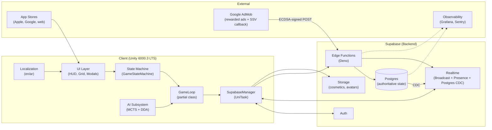
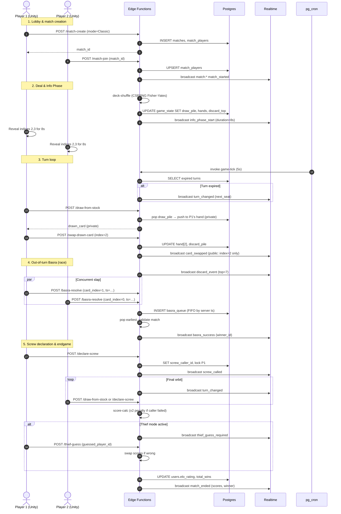
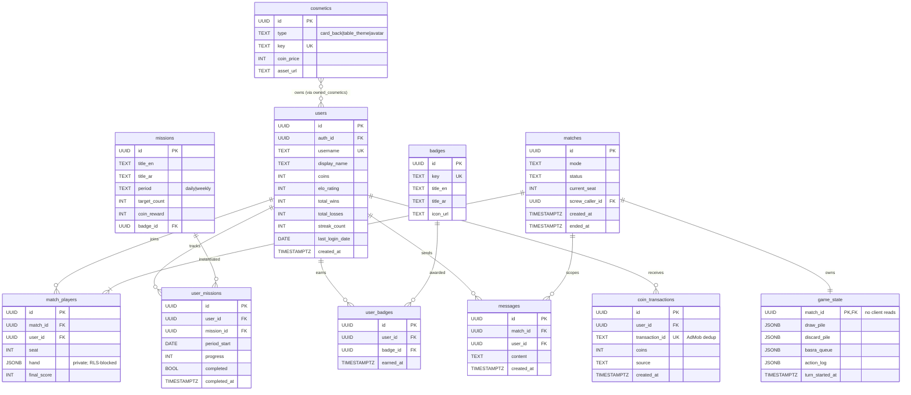
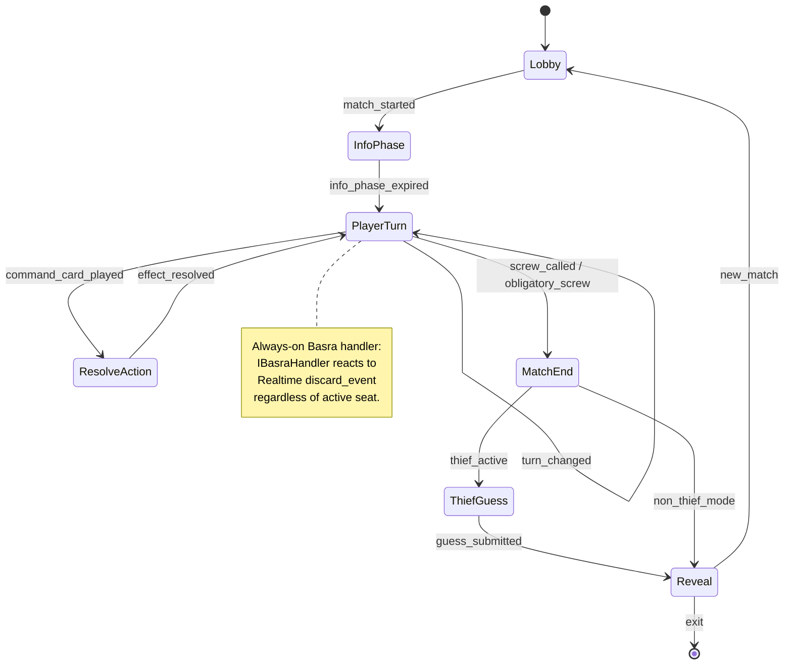
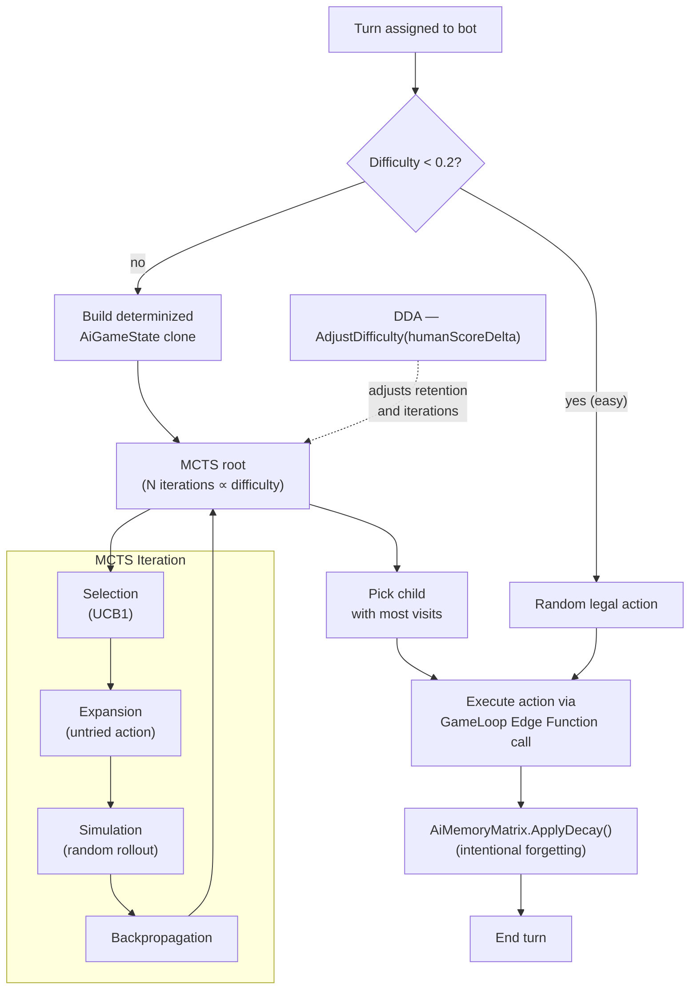
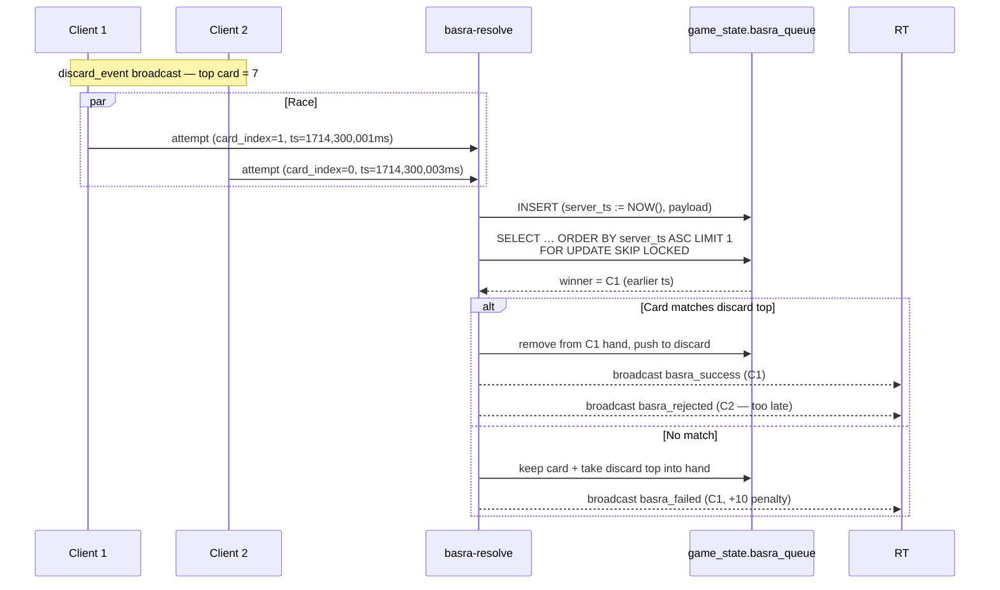
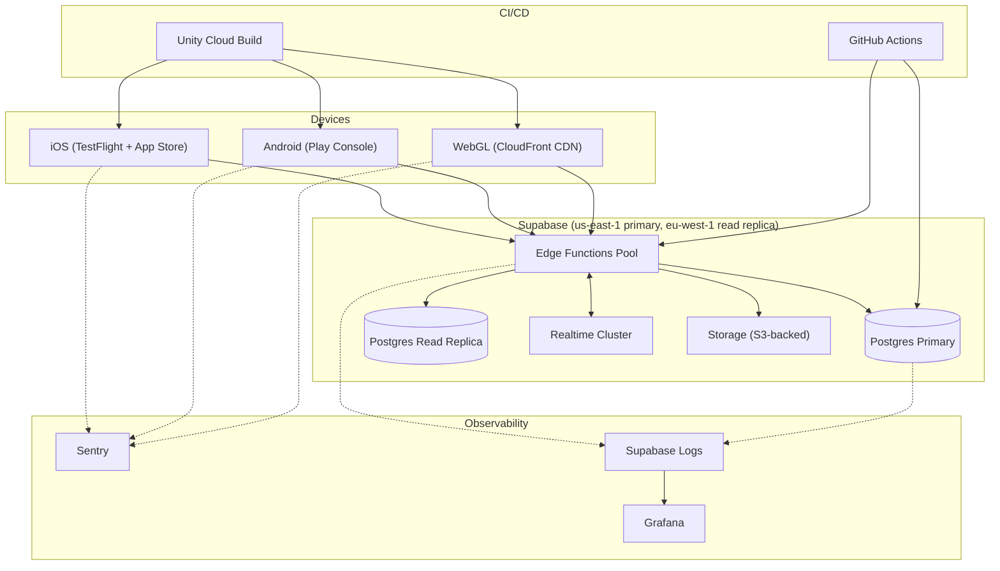

# Architecture — Skrew

> **Audience:** Engineers, architects, and technical reviewers.
> **Last reviewed:** 2026-04-28
> **Diagrams:** Rendered with Mermaid (GitHub-native).

---

## 1. System Overview

Skrew is a **client–server multiplayer card game**. The Unity client is a *thin presentation layer*; **all authoritative game state lives in Supabase Postgres** and all rules are evaluated by **Deno Edge Functions**. Real-time fan-out uses **Supabase Realtime Broadcast** (low-latency events) and **Realtime Presence** (connection tracking).

### High-level Component Diagram

---

## 2. Layer Responsibilities

| Layer | Path | Responsibility |
|-------|------|----------------|
| **UI** | `Assets/Scripts/UI/` | Render game state; capture user input; **never** mutate authoritative state. |
| **State Machine** | `Assets/Scripts/StateMachines/` | Phase transitions; handler interfaces (Basra, Thief, Ping/Pong). |
| **Game Loop** | `Assets/Scripts/Core/GameLoop*.cs` | Single entry point for Realtime events; thin façade over Edge Function calls. |
| **AI** | `Assets/Scripts/AI/` | MCTS + intentional memory decay + DDA; runs both online (disconnect bots) and offline (vs. CPU). |
| **Networking** | `Assets/Scripts/Networking/` | Presence, ephemeral broadcast (emojis, stickers). |
| **Social** | `Assets/Scripts/Social/` | Persistent chat backed by Postgres + CDC. |
| **Gamification** | `Assets/Scripts/Gamification/` | Streaks, missions, leaderboard, AdMob client wrapper. |
| **Localization** | `Assets/Scripts/Localization/` | JSON bundle loader + RTLTMPro adapter. |
| **Edge Functions** | `supabase/functions/` | Authoritative rule engine: shuffle, draw, swap, Basra, scoring, SSV. |
| **Migrations** | `supabase/migrations/` | Versioned schema, RLS, cron jobs, RPCs. |

**Strict rule:** *Clients never receive opponents' face-down card values.* The `game_state` table has RLS that blocks **all** client reads (`USING (FALSE)`); hand info is delivered exclusively via Edge Functions or via personalised Realtime Broadcast payloads.

---

## 3. Match Lifecycle (Sequence Diagram)

---

## 4. Database ER Diagram

---

## 5. Client State Machine

---

## 6. AI Pipeline

**Key invariants:**
- **Intentional forgetting:** memory cleared on blind swap; probabilistic decay each turn (`retentionRate ∈ [0.4, 1.0]`, scaled by difficulty).
- **Determinization:** unknown opponent cards are sampled from the remaining-deck distribution before each MCTS rollout (imperfect information).
- **DDA bounds:** difficulty ∈ [0, 1], step = `clamp(humanScoreDelta * 0.02, -0.15, 0.15)` per round.

---

## 7. Real-Time Concurrency — Basra FIFO

The `FOR UPDATE SKIP LOCKED` pattern ensures **exactly-once** processing under concurrent invocations.

---

## 8. Deployment Topology

---

## 9. Threat Model (Abridged)

| Threat | Vector | Mitigation |
|--------|--------|------------|
| Cheat: peek opponent's hidden hand | Client memory inspection | Server-authoritative; `game_state` RLS = `FALSE` for clients |
| Cheat: force "Screw" with wrong score | Crafted Edge Function payload | Edge Function recomputes scores from server-side hand |
| Fraud: replay AdMob SSV callback | Replay attack | `coin_transactions.transaction_id UNIQUE` idempotency |
| Spam: flood Realtime channel | Malicious client | Channel rate-limit (10 msg/s); ban list |
| Privacy: leak chat to non-members | Mis-scoped RLS | `messages` RLS scoped by `match_id` membership |
| Account theft | Stolen JWT | 1 h JWT lifetime; refresh tokens revocable; 2FA in roadmap |

---

## 10. Quality Attributes

| Attribute | Target | Measured by |
|-----------|--------|-------------|
| **Latency** | p95 ≤ 350 ms turn-action round-trip | Edge Function logs + client timing |
| **Throughput** | 5 000 concurrent matches per region | Load test in CI |
| **Availability** | 99.9% monthly | Supabase status + uptime probe |
| **Crash-free** | ≥ 99.3% sessions | Sentry |
| **Determinism** | Repro of any reported match from `match_actions` | Server-side replay tool |
| **Accessibility** | WCAG 2.1 AA on UI text | Manual + automated audits |

---

## 11. Open Architectural Questions

1. **CRDT vs server-authoritative for chat history?** — Currently server-authoritative; consider a Y.js layer if collaborative editing is added.
2. **Move to Cloudflare Workers** — sub-50 ms edge globally; trade-off: lose Supabase's typed SDK convenience.
3. **Deterministic rollback netcode** for tournaments — required for esports parity.
4. **Avatar pipeline** — Ready Player Me vs in-house?

These are tracked in `FUTURE_PLAN.md` and reviewed each quarter.
